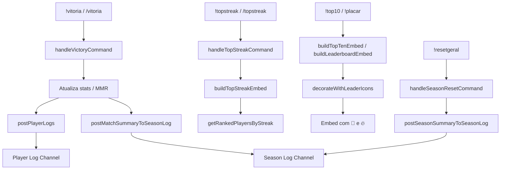

# Design Document — ranking-enhancements

## Overview

Esta feature adiciona melhorias visuais e funcionais ao sistema de ranking do bot-caps-discord:

1. **Destaque do Rank Leader** — ícone 👑 no primeiro colocado dos embeds `!top10` e `!placar`.
2. **Destaque do Streak Leader** — ícone 🔥 no(s) jogador(es) com maior `winStreak` ativa, mais campo de rodapé com o valor.
3. **Comando `!topstreak`** — novo ranking Top 10 de maiores sequências de vitórias consecutivas ativas.
4. **Player Log Channel** — canal dedicado a logs individuais por jogador ao final de cada partida.
5. **Season Log Channel** — canal dedicado a resumos de partida e de temporada.

Todas as mudanças são aditivas: nenhuma lógica existente de MMR, balanceamento ou persistência é alterada.

---

## Architecture

O bot segue uma arquitetura em camadas:

```
Discord Events (index.js)
        │
        ▼
Command Handlers (commands/legacyCommands.js)
        │
        ▼
Embed Builders / Utils (utils/lobbyUtils.js)
        │
        ▼
Data Layer (services/dataService.js → MongoDB)
```

As mudanças desta feature se concentram em:

- `utils/lobbyUtils.js` — novas funções de build de embed e helpers de streak.
- `commands/legacyCommands.js` — novo handler `handleTopStreakCommand`, chamadas de postagem nos canais de log.
- `index.js` — registro do slash command `/topstreak`.
- `config.json` — dois novos campos: `playerLogChannelId` e `seasonLogChannelId`.



---

## Components and Interfaces

### 1. `decorateWithLeaderIcons(entries, rankedPlayers)` — `lobbyUtils.js`

Função pura que recebe o array de strings de entrada do embed e o array de jogadores ranqueados, e retorna o array decorado com 👑 (primeiro colocado) e 🔥 (streak leader(s)).

```js
/**
 * @param {string[]} entries - linhas do embed já formatadas
 * @param {object[]} rankedPlayers - jogadores ordenados por MMR (saída de getRankedPlayersByMode)
 * @returns {{ decoratedEntries: string[], streakFooter: string|null }}
 */
function decorateWithLeaderIcons(entries, rankedPlayers)
```

- Identifica o `maxStreak = Math.max(...rankedPlayers.map(p => p.winStreak))`.
- Se `maxStreak >= 1`, marca todos os jogadores com `winStreak === maxStreak` com 🔥.
- Marca o jogador na posição 0 com 👑.
- Retorna também `streakFooter` no formato `🔥 Maior Streak Ativa: <nickname> (<N> vitórias seguidas)` ou `null` se não houver streak.

### 2. `buildTopStreakEmbed(statsData, mode, format)` — `lobbyUtils.js`

Constrói o `Top10_Streak_Embed`.

```js
/**
 * @param {object} statsData
 * @param {string} mode - QUEUE_MODES.CLASSIC | QUEUE_MODES.ARAM
 * @param {string|null} format
 * @returns {EmbedBuilder}
 */
function buildTopStreakEmbed(statsData, mode, format = null)
```

Internamente chama `getRankedPlayersByStreak(statsData, mode, format)`.

### 3. `getRankedPlayersByStreak(statsData, mode, format)` — `lobbyUtils.js`

```js
/**
 * @returns {object[]} jogadores com winStreak >= 1, ordenados por streak desc, wins desc
 */
function getRankedPlayersByStreak(statsData, mode, format = null)
```

### 4. `postPlayerLogs(guild, matchResult, statsData)` — `lobbyUtils.js`

Posta um embed individual por jogador no `playerLogChannelId`. Silencioso se o canal não estiver configurado.

```js
/**
 * @param {Guild} guild
 * @param {object} matchResult - { match, winnerTeam, playerDeltas: Map<discordId, {before, after, result}> }
 * @param {object} statsData
 */
async function postPlayerLogs(guild, matchResult, statsData)
```

### 5. `buildPlayerMatchLogEmbed(player, delta, match)` — `lobbyUtils.js`

Constrói o embed individual de log de partida para um jogador.

```js
/**
 * @param {object} player - dados do jogador na partida
 * @param {object} delta - { mmrBefore, mmrAfter, result: 'vitória'|'derrota', winStreak }
 * @param {object} match - dados da partida (modo, lobby, timestamp)
 * @returns {EmbedBuilder}
 */
function buildPlayerMatchLogEmbed(player, delta, match)
```

### 6. `postMatchSummaryToSeasonLog(guild, matchResult)` — `lobbyUtils.js`

Posta o resumo agregado da partida no `seasonLogChannelId`. Silencioso se não configurado.

```js
/**
 * @param {Guild} guild
 * @param {object} matchResult - { match, winnerTeam, teamOneAvgDelta, teamTwoAvgDelta }
 */
async function postMatchSummaryToSeasonLog(guild, matchResult)
```

### 7. `postSeasonSummaryToSeasonLog(guild, archivedSeason)` — `lobbyUtils.js`

Posta o resumo de temporada no `seasonLogChannelId` ao executar `!resetgeral`.

```js
/**
 * @param {Guild} guild
 * @param {object} archivedSeason - saída de archiveCurrentSeason
 */
async function postSeasonSummaryToSeasonLog(guild, archivedSeason)
```

### 8. `handleTopStreakCommand(message, args)` — `legacyCommands.js`

Handler do comando `!topstreak [aram] [1x1]`.

### Modificações em funções existentes

| Função | Mudança |
|---|---|
| `buildTopTenEmbed` | Chama `decorateWithLeaderIcons` antes de montar os fields; adiciona `streakFooter` como field extra |
| `buildLeaderboardEmbed` | Idem |
| `handleVictoryCommand` | Após salvar stats, chama `postPlayerLogs` e `postMatchSummaryToSeasonLog` |
| `handleSeasonResetCommand` | Após arquivar, chama `postSeasonSummaryToSeasonLog` |

---

## Data Models

### Campos existentes utilizados (sem alteração)

```js
// statsData.players[key].modes[modeKey]
{
  customWins: Number,
  customLosses: Number,
  baseMmr: Number,
  internalRating: Number,
  winStreak: Number   // já persistido
}
```

### Novos campos em `config.json`

```json
{
  "textChannels": {
    "playerLogChannelId": "<ID_DO_CANAL>",
    "seasonLogChannelId": "<ID_DO_CANAL>"
  }
}
```

Ambos são opcionais. Se ausentes, as funções de postagem retornam silenciosamente.

### Estrutura de `matchResult` (objeto interno, não persistido)

```js
{
  match: { /* dados da partida */ },
  winnerTeam: '1' | '2',
  playerDeltas: {
    [discordId]: {
      mmrBefore: Number,
      mmrAfter: Number,
      result: 'vitória' | 'derrota',
      winStreak: Number
    }
  },
  teamOneAvgDelta: Number,
  teamTwoAvgDelta: Number
}
```

Este objeto é construído dentro de `handleVictoryCommand` e passado para as funções de postagem. Não é persistido no MongoDB.

---

## Correctness Properties

*A property is a characteristic or behavior that should hold true across all valid executions of a system — essentially, a formal statement about what the system should do. Properties serve as the bridge between human-readable specifications and machine-verifiable correctness guarantees.*

### Property 1: Rank Leader sempre recebe 👑

*For any* lista não-vazia de jogadores ranqueados, o embed gerado por `buildTopTenEmbed` ou `buildLeaderboardEmbed` SHALL conter o ícone 👑 exatamente uma vez, associado ao jogador na primeira posição.

**Validates: Requirements 1.1, 1.3**

---

### Property 2: Streak Leader(s) recebem 🔥 e campo de rodapé

*For any* lista de jogadores onde pelo menos um possui `winStreak >= 1`, o embed gerado SHALL conter o ícone 🔥 em todos e somente os jogadores com o valor máximo de `winStreak`, e SHALL conter um field com o formato `🔥 Maior Streak Ativa: <nickname> (<N> vitórias seguidas)` referenciando o jogador com maior streak.

**Validates: Requirements 2.1, 2.2, 2.4**

---

### Property 3: Ícones combinados quando Rank Leader = Streak Leader

*For any* lista de jogadores onde o jogador com maior MMR também possui a maior `winStreak`, o embed gerado SHALL conter ambos os ícones 👑 e 🔥 associados a esse jogador.

**Validates: Requirements 2.5**

---

### Property 4: Top Streak ordenado e filtrado corretamente

*For any* conjunto de jogadores com valores variados de `winStreak`, a função `getRankedPlayersByStreak` SHALL retornar apenas jogadores com `winStreak >= 1`, ordenados em ordem decrescente de `winStreak` e, em caso de empate, por número de vitórias totais decrescente, com no máximo 10 entradas no embed final.

**Validates: Requirements 3.1, 3.4, 3.6**

---

### Property 5: Player Log contém todos os campos obrigatórios

*For any* jogador participante de uma partida finalizada, o embed gerado por `buildPlayerMatchLogEmbed` SHALL conter: menção Discord, nickname, modo de jogo, resultado (vitória/derrota), MMR antes e depois, recorde W/L atualizado, `winStreak` atual e timestamp no formato `dd/MM/yyyy HH:mm` no fuso de São Paulo.

**Validates: Requirements 4.2, 4.5**

---

### Property 6: Season Log de partida contém todos os campos obrigatórios

*For any* partida finalizada, o embed de resumo gerado por `postMatchSummaryToSeasonLog` SHALL conter: modo, lobby, times (Time 1 e Time 2), vencedor e variação média de MMR de cada time.

**Validates: Requirements 5.5**

---

### Property 7: Season Log de temporada contém todos os campos obrigatórios

*For any* `Season_Archive` gerado por `archiveCurrentSeason`, o embed de resumo de temporada SHALL conter: número/label da temporada, data de início, data de encerramento, Top 5 jogadores por MMR em cada modo (Classic, ARAM, ARAM 1x1) e total de partidas jogadas.

**Validates: Requirements 5.2**

---

## Error Handling

| Cenário | Comportamento |
|---|---|
| `playerLogChannelId` ausente em `config.json` | `postPlayerLogs` retorna sem erro (early return) |
| `seasonLogChannelId` ausente em `config.json` | `postMatchSummaryToSeasonLog` e `postSeasonSummaryToSeasonLog` retornam sem erro |
| Canal configurado mas não encontrado no guild | `guild.channels.fetch` retorna `null`; função retorna sem erro |
| Canal encontrado mas sem permissão de envio | `channel.send` lança erro capturado com `.catch(() => null)` |
| Lista de jogadores vazia no `!topstreak` | Embed exibe mensagem "Não há sequências ativas no momento." |
| Lista de jogadores vazia no `!top10` / `!placar` | Comportamento existente mantido; sem ícone 👑 |
| Todos os jogadores com `winStreak = 0` | Nenhum ícone 🔥 exibido; campo de rodapé de streak omitido |

---

## Testing Strategy

### Abordagem dual

- **Testes unitários (exemplo)**: verificam comportamentos específicos e casos de borda com dados fixos.
- **Testes de propriedade (PBT)**: verificam as propriedades universais acima com dados gerados aleatoriamente.

### Biblioteca PBT

Usar **[fast-check](https://github.com/dubzzz/fast-check)** (JavaScript/Node.js). Cada teste de propriedade deve rodar com mínimo de **100 iterações**.

### Tag de referência

Cada teste de propriedade deve incluir comentário:
```
// Feature: ranking-enhancements, Property <N>: <texto da propriedade>
```

### Testes unitários (exemplos e casos de borda)

- Req 1.2: embed com lista vazia não contém 👑.
- Req 2.3: embed com todos `winStreak = 0` não contém 🔥 nem campo de rodapé de streak.
- Req 3.5: `buildTopStreakEmbed` com todos `winStreak = 0` retorna mensagem de "sem sequências ativas".
- Req 4.3: `postPlayerLogs` usa `config.textChannels.playerLogChannelId`.
- Req 4.4: `postPlayerLogs` sem `playerLogChannelId` configurado não lança erro.
- Req 5.3: `postMatchSummaryToSeasonLog` usa `config.textChannels.seasonLogChannelId`.
- Req 5.4: `postSeasonSummaryToSeasonLog` sem `seasonLogChannelId` configurado não lança erro.
- Req 5.1: `handleSeasonResetCommand` chama `postSeasonSummaryToSeasonLog` após arquivar.
- Req 5.6: embed de resumo de partida não contém variação individual de MMR por jogador.

### Testes de propriedade (PBT)

Cada propriedade listada na seção "Correctness Properties" deve ser implementada como um único teste PBT com `fc.assert(fc.property(...))`.

Geradores sugeridos:
- `fc.array(playerArb, { minLength: 1, maxLength: 20 })` para listas de jogadores.
- `playerArb` = `fc.record({ discordId: fc.string(), nickname: fc.string(), winStreak: fc.nat(), customWins: fc.nat(), customLosses: fc.nat(), adjustedMmr: fc.integer() })`.
- Para Property 3: filtrar/ajustar o gerador para garantir que o primeiro por MMR também tem o maior streak.
